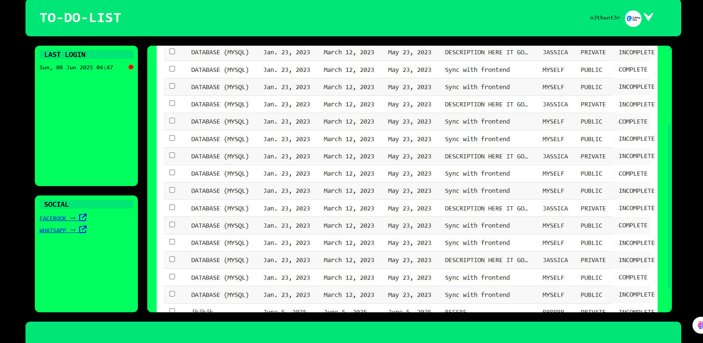

# To-Do List Application


## Overview
A Django-based To-Do List application for managing daily tasks with user authentication and a clean interface.

## Features
- User registration and login
- Add, edit, and delete tasks
- Mark tasks as complete/incomplete
- Filter tasks by status
- Responsive design

## Screenshots
<!-- Add your screenshots here -->



## Setup Instructions

1. **Clone the repository:**
   ```
   git clone https://github.com/benedictamankw18/todo-list.git
   cd django-todo/ToDoList
   ```

2. **Install dependencies:**
   ```
   pip install -r requirements.txt
   ```

3. **Apply migrations:**
   ```
   python manage.py migrate
   ```

4. **Run the development server:**
   ```
   python manage.py runserver
   ```

5. **Open your browser:**
   Visit [http://localhost:8000/](http://localhost:8000/)

## API Documentation
<!-- If you have API endpoints, document them here -->
- `GET /api/tasks/` - List all tasks
- `POST /api/tasks/` - Create a new task
- `PUT /api/tasks/<id>/` - Update a task
- `DELETE /api/tasks/<id>/` - Delete a task

## Running Tests
To run the unit tests:
```
python manage.py test
```

## Deployment
- Configure environment variables as needed.
- Collect static files:
  ```
  python manage.py collectstatic
  ```
- Deploy to your preferred platform (Heroku, PythonAnywhere, etc.).

## License
This project is licensed under the MIT License.

## Contact
For questions or support, contact [nethunterghana@gmail.com](mailto:nethunterghana@gmail.com).

## Demo Login

For demonstration purposes, you can use the following credentials:

- **Username:** `n3thunt3r`
- **Password:** `n3thunt3r`

> **Note:** Change these credentials in production and never share real user passwords publicly.
